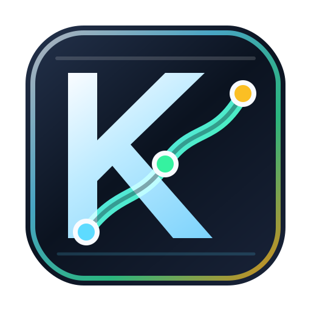
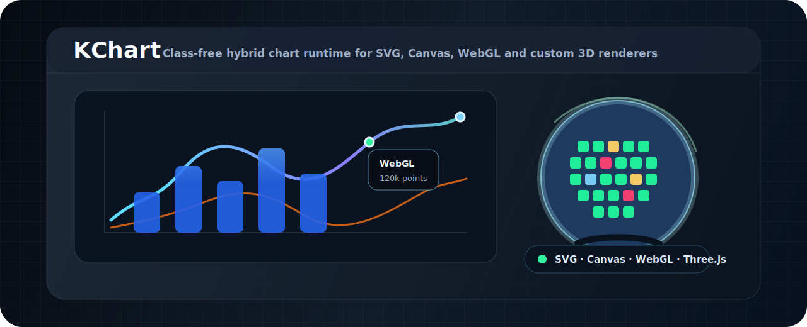
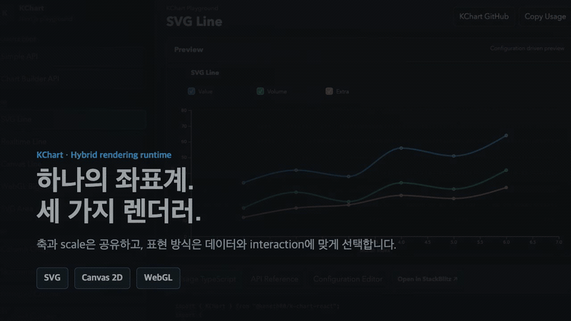

<p align="center">
  
  <br />
  
</p>

<h1 align="center">KChart</h1>

<p align="center">
  TypeScript 기반 class-free 하이브리드 차트 엔진입니다.<br />
  축, scale, layout은 코어가 계산하고 시각 표현은 SVG, Canvas, WebGL, Three.js renderer 함수가 담당합니다.
</p>

<p align="center">
  <a href="https://github.com/keneth80/k-chart/releases"></a>
  <a href="https://github.com/keneth80/k-chart/actions/workflows/ci.yml"></a>
  
  <a href="https://www.npmjs.com/package/@keneth80/k-chart"></a>
  <a href="https://github.com/keneth80/k-chart/blob/main/LICENSE"></a>
  <a href="https://k-chart-playground.vercel.app/"></a>
  <a href="https://k-chart-bench.vercel.app/"></a>
</p>

<p align="center">
  <code>SVG</code>
  <code>Canvas 2D</code>
  <code>WebGL</code>
  <code>Three.js</code>
  <code>CesiumJS</code>
  <code>MapLibre</code>
  <code>Candlestick</code>
  <code>LTTB</code>
  <code>OffscreenCanvas</code>
  <code>Tooltip Notes</code>
</p>

<p align="center">
  <a href="https://k-chart-playground.vercel.app/"><strong>Open Playground</strong></a>
  ·
  <a href="https://k-chart-bench.vercel.app/"><strong>View Benchmark</strong></a>
  ·
  <a href="#quick-start"><strong>Quick Start</strong></a>
  ·
  <a href="docs/functional-api.md"><strong>API Guide</strong></a>
  ·
  <a href="packages/k-chart-three/README.md"><strong>Three.js Adapter</strong></a>
</p>

<p align="center">
  <a href="https://stackblitz.com/fork/github/keneth80/k-chart/tree/main/examples/stackblitz-line-basic?title=KChart%20Line%20Basic&file=src/main.ts">
    
  </a>
  <br />
  <a href="https://stackblitz.com/fork/github/keneth80/k-chart/tree/main/examples/stackblitz-simple-api-basic?title=KChart%20Simple%20API&file=src/main.ts"><strong>Simple API</strong></a>
  ·
  <a href="https://stackblitz.com/fork/github/keneth80/k-chart/tree/main/examples/stackblitz-canvas-line-basic?title=KChart%20Canvas%20Line&file=src/main.ts"><strong>Canvas Line</strong></a>
  ·
  <a href="https://stackblitz.com/fork/github/keneth80/k-chart/tree/main/examples/stackblitz-webgl-line-basic?title=KChart%20WebGL%20Line&file=src/main.ts"><strong>WebGL Line</strong></a>
  ·
  <a href="https://stackblitz.com/fork/github/keneth80/k-chart/tree/main/examples/stackblitz-realtime-line-basic?title=KChart%20Realtime%20Line&file=src/main.ts"><strong>Realtime Line</strong></a>
  ·
  <a href="https://stackblitz.com/fork/github/keneth80/k-chart/tree/main/examples/stackblitz-worker-json-line?title=KChart%20Worker%20JSON%20Line&file=src/main.ts"><strong>Worker JSON</strong></a>
  ·
  <a href="https://stackblitz.com/fork/github/keneth80/k-chart/tree/main/examples/stackblitz-korea-region-map-basic?title=KChart%20Korea%20Region%20Map&file=src/main.ts"><strong>Korea Map</strong></a>
  ·
  <a href="https://stackblitz.com/fork/github/keneth80/k-chart/tree/main/examples/stackblitz-world-country-map-basic?title=KChart%20World%20Country%20Map&file=src/main.ts"><strong>World Map</strong></a>
  ·
  <a href="https://stackblitz.com/fork/github/keneth80/k-chart/tree/main/examples/stackblitz-column-basic?title=KChart%20Column&file=src/main.ts"><strong>Column</strong></a>
  ·
  <a href="https://stackblitz.com/fork/github/keneth80/k-chart/tree/main/examples/stackblitz-stacked-column-basic?title=KChart%20Stacked%20Column&file=src/main.ts"><strong>Stacked Column</strong></a>
  ·
  <a href="https://stackblitz.com/fork/github/keneth80/k-chart/tree/main/examples/stackblitz-candlestick-basic?title=KChart%20Candlestick&file=src/main.ts"><strong>Candlestick</strong></a>
  ·
  <a href="https://stackblitz.com/fork/github/keneth80/k-chart/tree/main/examples/stackblitz-plot-basic?title=KChart%20Plot&file=src/main.ts"><strong>Plot</strong></a>
  ·
  <a href="https://stackblitz.com/fork/github/keneth80/k-chart/tree/main/examples/stackblitz-radial-basic?title=KChart%20Radial&file=src/main.ts"><strong>Radial</strong></a>
  ·
  <a href="https://stackblitz.com/fork/github/keneth80/k-chart/tree/main/examples/stackblitz-pie-basic?title=KChart%20Pie&file=src/main.ts"><strong>Pie</strong></a>
  ·
  <a href="https://stackblitz.com/fork/github/keneth80/k-chart/tree/main/examples/stackblitz-doughnut-basic?title=KChart%20Doughnut&file=src/main.ts"><strong>Doughnut</strong></a>
  ·
  <a href="https://stackblitz.com/fork/github/keneth80/k-chart/tree/main/examples/stackblitz-multi-series-basic?title=KChart%20Multi%20Series&file=src/main.ts"><strong>Multi Series</strong></a>
  ·
  <a href="https://stackblitz.com/fork/github/keneth80/k-chart/tree/main/examples/stackblitz-options-basic?title=KChart%20Options&file=src/main.ts"><strong>Options</strong></a>
  ·
  <a href="https://stackblitz.com/fork/github/keneth80/k-chart/tree/main/examples/stackblitz-topology-basic?title=KChart%20Topology&file=src/main.ts"><strong>Topology</strong></a>
  ·
  <a href="https://stackblitz.com/fork/github/keneth80/k-chart/tree/main/examples/stackblitz-graph-basic?title=KChart%20Graph%20Chart&file=src/main.ts"><strong>Graph Chart</strong></a>
  ·
  <a href="https://stackblitz.com/fork/github/keneth80/k-chart/tree/main/examples/stackblitz-tree-basic?title=KChart%20Tree%20Chart&file=src/main.ts"><strong>Tree Chart</strong></a>
  ·
  <a href="https://stackblitz.com/fork/github/keneth80/k-chart/tree/main/examples/stackblitz-treemap-basic?title=KChart%20Treemap&file=src/main.ts"><strong>Treemap</strong></a>
  ·
  <a href="https://stackblitz.com/fork/github/keneth80/k-chart/tree/main/examples/stackblitz-sankey-basic?title=KChart%20Sankey%20Flow&file=src/main.ts"><strong>Sankey</strong></a>
  ·
  <a href="https://stackblitz.com/fork/github/keneth80/k-chart/tree/main/examples/stackblitz-three-wafer-basic?title=KChart%20Three.js%20Wafer&file=src/main.ts"><strong>Three.js Wafer</strong></a>
</p>

## Hybrid Rendering In 60 Seconds

<p align="center">
  <a href="https://raw.githubusercontent.com/keneth80/k-chart/main/docs/promotion/kchart-hybrid-rendering-60s-ko.mp4">
    
  </a>
</p>

<p align="center">
  <a href="https://raw.githubusercontent.com/keneth80/k-chart/main/docs/promotion/kchart-hybrid-rendering-60s-ko.mp4"><strong>Watch the 60-second video</strong></a>
  ·
  <a href="docs/promotion/hybrid-rendering-ko.md"><strong>Read the Korean technical article</strong></a>
</p>

## Overview

KChart는 TypeScript 기반 D3 하이브리드 차트 엔진입니다.

축, scale, layout은 차트 코어가 계산하고, 실제 시각 표현은 series renderer 함수가 담당합니다. Renderer는 같은 scale 정보를 받아 SVG, Canvas, WebGL 레이어 중 원하는 방식으로 그릴 수 있습니다. 새 저장소 기준 public API는 class-free 함수형 런타임입니다.

## Why KChart

KChart는 완성형 대시보드 차트만 제공하는 라이브러리라기보다, 업무 화면에서 필요한 시각화를 가볍게 조립하기 위한 rendering runtime입니다. 축과 scale은 코어가 책임지고, series와 option은 함수형 renderer로 분리되어 SVG, Canvas, WebGL, Three.js, CesiumJS, MapLibre 같은 표현 계층을 필요할 때만 붙일 수 있습니다.

| Focus | KChart approach |
| --- | --- |
| Hybrid rendering | 하나의 chart runtime에서 SVG, Canvas 2D, WebGL series를 함께 사용할 수 있습니다. |
| Large data | WebGL line/point, interleaved buffer, LTTB downsampling, OffscreenCanvas worker hook을 제공합니다. |
| Custom visualization | `createCustomSeries(...)`로 scale, layer, plot size를 받은 뒤 원하는 renderer를 직접 구현할 수 있습니다. |
| Optional adapters | Three.js, CesiumJS, MapLibre는 별도 package로 분리해 기본 chart bundle에 3D/map 비용을 섞지 않습니다. |
| Business UI fit | tooltip note, fixed guide line, spec area, topology, candlestick처럼 운영 화면에서 바로 쓰는 옵션을 포함합니다. |
| Relationship analysis | `createGraphSeries(...)`로 source-target-metric 데이터를 Force/Circular 관계망으로 표현합니다. |
| Hierarchy analysis | `createTreeSeries(...)`로 id-parent 행을 조직도, 분류 체계, 의존 구조 형태로 표현합니다. |
| Part-to-whole analysis | `createTreemapSeries(...)`로 동일 metric의 구성 비중을 사각형 면적으로 비교합니다. |
| Flow analysis | `createSankeySeries(...)`로 단계별 흐름의 상대적인 크기와 이탈 지점을 표현합니다. |

### Size And Capability Snapshot

아래 수치는 2026-07-01 기준 package footprint입니다. KChart는 현재 저장소에서 `npm pack --dry-run`으로 측정했고, 다른 패키지는 npm registry의 `dist.unpackedSize`를 사용했습니다. 실제 app bundle size는 bundler, tree-shaking, import 방식, CSS/asset 포함 여부에 따라 달라지므로, 절대 성능 순위가 아니라 package footprint를 비교하기 위한 참고값입니다.

| Package | Version | npm unpacked size | Primary renderer model | WebGL path |
| --- | ---: | ---: | --- | --- |
| `@keneth80/k-chart` | `1.9.0` | `1.1 MB` | SVG + Canvas + WebGL functional series | Built-in line/point WebGL series |
| `chart.js` | `4.5.1` | `5.89 MiB` | Canvas chart components | Not a core renderer target |
| `plotly.js-dist-min` | `3.6.0` | `4.62 MiB` | Prebuilt Plotly distribution | WebGL trace families |
| `echarts` | `6.1.0` | `57.50 MiB` | Canvas/SVG chart platform | Extension-oriented GL use cases |
| `highcharts` | `13.0.0` | `68.12 MiB` | SVG chart platform | Boost/module-oriented large data path |

Reproduce the package size numbers:

```bash
npm pack --dry-run
npm view chart.js@latest version dist.unpackedSize
npm view plotly.js-dist-min@latest version dist.unpackedSize
npm view echarts@latest version dist.unpackedSize
npm view highcharts@latest version dist.unpackedSize
```

### Performance Positioning

KChart의 성능 방향은 “모든 기능을 하나의 거대한 chart object에 넣기”가 아니라, 데이터 양과 표현 방식에 맞춰 renderer를 선택하는 것입니다.

- 작은 데이터와 선명한 DOM interaction이 필요하면 SVG series를 사용합니다.
- 수천에서 수만 개의 point를 빠르게 그려야 하면 Canvas series를 사용합니다.
- 더 큰 line/point 데이터나 잦은 viewport 변경이 있으면 WebGL series와 LTTB downsampling을 조합합니다.
- 3D, 지도, 지구본은 optional adapter package로 분리해 필요한 화면에서만 로드합니다.
- 렌더링 성능 비교와 재현 조건은 [KChart Benchmark](https://k-chart-bench.vercel.app/)에서 확인할 수 있습니다. 결과를 해석할 때는 dataset, viewport, browser, 측정 종점과 각 라이브러리 설정을 함께 확인해야 합니다.

## Core Concept

```txt
createKChart(config)
 ├─ axes -> scales
 ├─ svg/canvas/webgl layers
 └─ series[]
      ├─ createLineSeries(...)
      ├─ createCanvasLineSeries(...)
      ├─ createCanvasPointSeries(...)
      ├─ createCanvasCandlestickSeries(...)
      ├─ createWebglLineSeries(...)
      ├─ createWebglPointSeries(...)
      └─ createCustomSeries({ render(context) })
```

- `createKChart(...)`는 class 없이 plain runtime state와 controller를 만듭니다.
- `createLineSeries(...)`는 SVG line renderer를 함수형 series로 생성합니다.
- `createCanvasLineSeries(...)`, `createCanvasPointSeries(...)`는 Canvas 2D renderer를 함수형 series로 생성합니다.
- `createCanvasCandlestickSeries(...)`는 OHLC 데이터를 Canvas 2D 캔들차트로 렌더링합니다.
- `createWebglLineSeries(...)`는 대용량 line renderer를 WebGL `LINE_STRIP` 기반 함수형 series로 생성합니다.
- `createWebglPointSeries(...)`는 WebGL point renderer를 함수형 series로 생성합니다.
- `createCustomSeries(...)`는 renderer 함수를 그대로 series로 사용합니다.
- `render(context)`는 `group`, `data`, `scales`, `xScale`, `yScale`, `plotSize`, `color`, `getCanvas`, `getWebglCanvas`를 받습니다.
- Canvas/WebGL 시각화도 renderer 안에서 필요한 layer를 받아 직접 그릴 수 있습니다.

### Three.js Custom Series

Three.js는 KChart 코어 의존성이 아닙니다. 가벼운 3D scene wrapper와
반도체 웨이퍼 모니터링 객체가 필요하면 optional package인
`@keneth80/k-chart-three`를 설치합니다. 직접 renderer를 만들고 싶다면
`createCustomSeries(...)`와 `getWebglCanvas()`를 사용해 선택적으로 결합할 수도 있습니다.

```bash
npm install @keneth80/k-chart-three three
```

[`packages/k-chart-three`](packages/k-chart-three/README.md)는 renderer, camera,
OrbitControls, resize, pointer event, dispose 생명주기를 처리하는
`createKThreeScene(...)` wrapper를 제공합니다. `createThreeWaferSeries(...)`는
KChart series contract에 맞춘 웨이퍼 모니터링 예제이며, die cell은
`InstancedMesh`로 렌더링합니다.

```ts
import { createThreeWaferSeries, createWaferDies } from '@keneth80/k-chart-three';
import '@keneth80/k-chart-three/style.css';

const chart = createKChart({
    selector: '#chart',
    data: createWaferDies({ rows: 29, cols: 29 }),
    axes: [],
    grid: { visible: false },
    legend: { visible: false },
    series: [
        createThreeWaferSeries({
            selector: 'wafer-a17',
            fields: {
                id: 'id',
                row: 'row',
                col: 'col',
                status: 'status',
                value: 'value',
                label: 'label'
            }
        })
    ]
});
```

양자리의 실제 주요 별 배치를 기반으로 별 노드와 연결선을 3D로 표현하는 전체 예제는
[`examples/three-constellation-series.ts`](examples/three-constellation-series.ts)에 있습니다.

```ts
const constellation = createThreeConstellationSeries({
    selector: 'aries',
    idField: 'id',
    labelField: 'label',
    xField: 'x',
    yField: 'y',
    zField: 'z',
    sizeField: 'size',
    colorField: 'color',
    links: [
        { source: 'mesarthim', target: 'sheratan' },
        { source: 'sheratan', target: 'hamal' }
    ]
});
```

예제는 기존 KChart WebGL canvas를 Three.js renderer에 주입하고, `InstancedMesh`,
`LineSegments`, `OrbitControls`, `Raycaster`, resize 및 dispose 생명주기를 처리합니다.

## Install

```bash
npm install @keneth80/k-chart
```

## Playground

- Live playground: [https://k-chart-playground.vercel.app/](https://k-chart-playground.vercel.app/)
- Local playground URL: `http://127.0.0.1:9011`

The playground demonstrates the React wrapper, chart examples, configuration editor, and AI Builder flow.

## Benchmark

- Live benchmark: [https://k-chart-bench.vercel.app/](https://k-chart-bench.vercel.app/)

The benchmark publishes reproducible rendering measurements alongside the dataset size, browser environment, library versions, and measurement methodology. Use the methodology shown with each result when comparing KChart with other chart libraries.

## Local Development

```bash
npm install
npm run build
```

Demo:

```bash
npm run dev
```

Then open `http://127.0.0.1:9003/`.

## Guides

- [Functional API Guide](docs/functional-api.md)
- [Configuration Reference](docs/configuration-reference.md)
- [Code Graph Handoff](docs/code-graph-handoff.md)
- [React And Next.js Guide](docs/react-nextjs.md)
- [Release Guide](docs/release.md)
- [React Wrapper Example](examples/react-wrapper.tsx)
- [Canvas Candlestick Example](examples/canvas-candlestick-series.ts)
- [SVG Globe Map Example](examples/svg-globe-map-series.ts)
- [MapLibre Globe Drilldown Adapter](packages/k-chart-maplibre/README.md)
- [CesiumJS 3D Route Adapter](packages/k-chart-cesium/README.md)
- [Three.js Scene And Wafer Adapter](packages/k-chart-three/README.md)

## Module Structure

KChart keeps its public root API compatible while separating implementation by
responsibility:

```text
src/
├── core/       # contracts, state, layers, scales, and chart lifecycle
├── series/     # SVG, Canvas, WebGL, candlestick, and globe renderers
├── options/    # spec area, fixed guide line, and cursor line
├── worker/     # OffscreenCanvas worker entry
└── utils/      # renderer-independent algorithms such as LTTB
```

Existing root imports continue to work. Explicit subpath imports are also
available:

```ts
import {createKChart} from '@keneth80/k-chart/core';
import {createLineChart, chartConfig} from '@keneth80/k-chart/presets';
import {createCanvasLineSeries} from '@keneth80/k-chart/series';
import {createGuideLineOption} from '@keneth80/k-chart/options';
import {downsampleLTTB} from '@keneth80/k-chart/utils';
import {startKChartRenderWorker} from '@keneth80/k-chart/worker';
```

The core calls concrete renderers only through the
`KChartSeries.render(context)` contract.

## Quick Start

처음 시작할 때는 preset API를 사용하면 축과 series boilerplate를 줄일 수 있습니다.

```ts
import {createLineChart, chartConfig} from '@keneth80/k-chart';

type SalesPoint = {
    month: string;
    revenue: number;
    orders: number;
};

const data: SalesPoint[] = [
    {month: 'Jan', revenue: 42, orders: 320},
    {month: 'Feb', revenue: 48, orders: 360},
    {month: 'Mar', revenue: 45, orders: 340}
];

createLineChart<SalesPoint>({
    selector: '#line-chart',
    data,
    x: {field: 'month', type: 'point', title: 'Month'},
    y: {field: 'revenue', type: 'number', title: 'Revenue'},
    title: 'Revenue Trend',
    animation: true
});

chartConfig<SalesPoint>(data)
    .selector('#column-chart')
    .title('Orders By Month')
    .x('month', 'point', {title: 'Month'})
    .y('orders', 'number', {title: 'Orders'})
    .column({color: '#56d08f'})
    .tooltip()
    .animation()
    .render();
```

Preset API는 내부적으로 `KChartConfiguration`을 생성합니다. 더 세밀한 제어가 필요하면 아래 advanced API처럼 `createKChart(...)`, `axes`, `series`를 직접 구성하면 됩니다.

## Advanced Quick Start

```ts
import {
    createKChart,
    createLineSeries,
    KChartController
} from '@keneth80/k-chart';

interface TrafficPoint {
    time: string;
    value: number;
}

const data: TrafficPoint[] = [
    { time: '00:00', value: 12 },
    { time: '01:00', value: 18 },
    { time: '02:00', value: 21 }
];

const chart: KChartController<TrafficPoint> = createKChart<TrafficPoint>({
    selector: '#chart',
    data,
    axes: [
        { field: 'time', type: 'string', placement: 'bottom' },
        { field: 'value', type: 'number', placement: 'left' }
    ],
    series: [
        createLineSeries({
            selector: 'traffic-line',
            displayName: 'Traffic',
            xField: 'time',
            yField: 'value',
            curve: true,
            dot: true
        })
    ]
});

chart.render();
```

## Custom Series

아래 예제는 차트 코어가 계산한 x/y scale을 받아 SVG 원을 그립니다. Class 상속이나 interface 구현 없이 renderer 함수만 넘깁니다.

```ts
import {
    createKChart,
    createCustomSeries
} from '@keneth80/k-chart';

interface CirclePoint {
    x: number;
    y: number;
    radius: number;
}

const circleSeries = createCustomSeries<CirclePoint>({
    selector: 'custom-circle',
    displayName: 'Custom Circle',
    xField: 'x',
    yField: 'y',
    render({ group, data, xScale, yScale, color }) {
        if (!xScale || !yScale) {
            return;
        }

        group.selectAll('.custom-circle')
            .data(data)
            .join('circle')
            .attr('class', 'custom-circle')
            .attr('cx', (point) => xScale.scale(point.x))
            .attr('cy', (point) => yScale.scale(point.y))
            .attr('r', (point) => point.radius)
            .style('fill', color)
            .style('fill-opacity', 0.6);
    }
});

createKChart<CirclePoint>({
    selector: '#chart',
    data: [
        { x: 1, y: 12, radius: 8 },
        { x: 2, y: 18, radius: 12 },
        { x: 3, y: 9, radius: 6 }
    ],
    axes: [
        { field: 'x', type: 'number', placement: 'bottom', min: 0, max: 4 },
        { field: 'y', type: 'number', placement: 'left', min: 0, max: 24 }
    ],
    series: [
        circleSeries
    ]
}).render();
```

Full example: [examples/custom-circle-series.ts](examples/custom-circle-series.ts)

## Canvas Or WebGL Renderer

기본 Canvas/WebGL renderer는 factory로 바로 사용할 수 있습니다.

```ts
import {
    createCanvasLineSeries,
    createCanvasPointSeries,
    createWebglLineSeries,
    createWebglPointSeries
} from '@keneth80/k-chart';

const canvasLine = createCanvasLineSeries<Point>({
    selector: 'canvas-line',
    xField: 'x',
    yField: 'y',
    color: '#56d08f',
    lineWidth: 3
});

const canvasPoints = createCanvasPointSeries<Point>({
    selector: 'canvas-points',
    xField: 'x',
    yField: 'y',
    radius: 4,
    color: '#5db8ff'
});

const webglPoints = createWebglPointSeries<Point>({
    selector: 'webgl-points',
    xField: 'x',
    yField: 'y',
    pointSize: 8,
    color: '#f3b45b'
});

const webglLine = createWebglLineSeries<Point>({
    selector: 'webgl-large-line',
    displayName: '120k WebGL Line',
    xField: 'x',
    yField: 'y',
    color: '#5db8ff',
    lineWidth: 1,
    downsample: {
        enabled: true,
        threshold: ({ plotSize }) => Math.floor(plotSize.width)
    }
});
```

## Candlestick Chart

Canvas candlestick series renders OHLC stock data. Set the y-axis `field` to the value you want tooltips and cursor guides to use, usually `close`, and set `domainFields` to `['low', 'high']` so the axis covers the full candle range.

```ts
import {
    createCanvasCandlestickSeries,
    createKChart
} from '@keneth80/k-chart';

interface StockPoint {
    date: string;
    open: number;
    high: number;
    low: number;
    close: number;
    previousClose: number;
}

const data: StockPoint[] = [
    { date: '2026-06-01', open: 101, high: 108, low: 98, close: 106, previousClose: 100 },
    { date: '2026-06-02', open: 106, high: 110, low: 102, close: 103, previousClose: 106 },
    { date: '2026-06-03', open: 103, high: 112, low: 101, close: 111, previousClose: 103 }
];

createKChart<StockPoint>({
    selector: '#chart',
    data,
    axes: [
        { field: 'date', type: 'time', placement: 'bottom', tickCount: 5, domain: ['2026-05-31', '2026-06-04'] },
        {
            field: 'close',
            type: 'number',
            placement: 'left',
            title: 'Price',
            domainFields: ['low', 'high']
        }
    ],
    tooltip: { visible: true },
    series: [
        createCanvasCandlestickSeries({
            selector: 'price',
            displayName: 'Price',
            xField: 'date',
            openField: 'open',
            highField: 'high',
            lowField: 'low',
            closeField: 'close',
            colorMode: 'previous-close',
            previousCloseField: 'previousClose',
            upColor: '#22c55e',
            downColor: '#ef4444'
        })
    ]
}).render();
```

`colorMode` 기본값은 `'open-close'`이며 `close`와 `open`을 비교합니다. 한국 주식 화면처럼 전일 종가 대비 상승/하락 색상을 쓰려면 `colorMode: 'previous-close'`를 지정합니다. `previousCloseField`를 넘기면 해당 필드를 기준으로 비교하고, 생략하면 현재 데이터 배열에서 바로 앞 캔들의 `closeField` 값을 사용합니다.

## Globe Map

SVG globe series renders latitude/longitude markers on a draggable orthographic globe. Marker coordinates use ordinary geographic values: `lat` for latitude and `lon` for longitude. Click handlers receive the original data item, projected screen position, and the original browser event. A World Atlas 110m land layer is rendered by default with country borders as a separate mesh; set `landVisible: false` to hide it, or pass `landGeoJson` to use your own GeoJSON land/country data. `landMode: 'countries'` switches the fill layer to country features so `landFill`, `landStroke`, and `landOpacity` callbacks can style countries per feature. Set `zoom: { enabled: true }` to enable wheel zoom on desktop and pinch zoom on touch devices. Add `controls: true` to show in-chart zoom controls when page scrolling makes wheel zoom awkward. Set `drilldown.enabled` to let marker clicks focus a coordinate with a transition overlay. `transition` accepts `'warp'`, `'cloud'`, or `'none'`; the cloud transition keeps the destination covered until an asynchronous `onEnter` callback has finished loading. `drilldown.mode: 'zoom'` keeps the orthographic globe and zooms into the marker, while `mode: 'map'` switches to a focused Mercator map. With `autoMapOnZoom: true`, zooming past `mapZoomThreshold` automatically selects the registered city nearest the center of the visible globe and switches to the flat map. Zooming back below `globeZoomThreshold` returns to the globe.

Use `drilldown.mode: 'external-map'` with `@keneth80/k-chart-maplibre` when the destination needs real vector/raster map tiles, roads, interactive place markers, clustering, and popups. The `onEnter` context includes `exit()`, allowing the external map's back control to restore the globe. Cloud timing can be controlled with `duration`, or separately with `coverDuration` and `revealDuration`. Set `respectReducedMotion: false` when those exact durations must be preserved even if the operating system requests reduced motion. MapLibre renders the map but does not provide restaurant or address search data; connect a separate place/geocoding provider and pass the resulting coordinates to `setPlaces()` or `addPlaces()`.

For a full WebGL globe with time-based movement paths, use the optional
`@keneth80/k-chart-cesium` package. It accepts ordinary latitude/longitude
records, custom field mappings, or GeoJSON `LineString` routes. Timestamped
records are converted to Cesium `SampledPositionProperty` samples and can be
played through the Cesium clock with a moving marker, route trail, and optional
camera tracking. The adapter is provider-neutral by default: applications pass their own
`imageryProvider`, `terrainProvider`, optional `ionAccessToken`, and attribution.
Use `initialView` to set the first camera longitude, latitude, and height when
the default Cesium home view is too close for a dashboard panel. When timeline
or animation controls are visible, start farther out and set route
`flyToOnAdd: false` so the first render stays centered; call `handle.flyTo()` or
`controller.flyToRoute(id)` later when the user wants to focus the route.
Cesium atmosphere and lighting correction is enabled by default through
`realisticAtmosphere`, which adjusts only rendering settings and does not bundle
map, terrain, satellite, or 3D Tiles data. In 2D and Columbus View flat-map
modes, KChart disables Cesium lighting and atmosphere by default so the
day/night globe shadow does not cover the map; set
`realisticAtmosphere.disableLightingInFlatModes: false` only if that lighting is
intentional.
CesiumJS is Apache-2.0 licensed, while Cesium ion and third-party map, terrain,
satellite, place-search, or 3D Tiles services have separate terms. Do not
hard-code private provider keys in reusable library code, and keep Cesium/provider
credits and copyright notices visible.

Detailed Cesium usage, asset deployment, provider/license notes, and first-view
camera tips are documented in
[`packages/k-chart-cesium/README.md`](packages/k-chart-cesium/README.md).

```ts
import {
    createKChart,
    createSvgGlobeSeries
} from '@keneth80/k-chart';

interface CityPoint {
    name: string;
    lat: number;
    lon: number;
    url: string;
}

const cities: CityPoint[] = [
    { name: 'Seoul', lat: 37.5665, lon: 126.9780, url: 'https://en.wikipedia.org/wiki/Seoul' },
    { name: 'New York', lat: 40.7128, lon: -74.0060, url: 'https://en.wikipedia.org/wiki/New_York_City' }
];

createKChart<CityPoint>({
    selector: '#chart',
    data: cities,
    grid: { visible: false },
    legend: { visible: false },
    tooltip: { visible: false },
    axes: [],
    series: [
        createSvgGlobeSeries({
            selector: 'cities',
            latField: 'lat',
            lonField: 'lon',
            labelField: 'name',
            initialRotate: [-120, -18, 0],
            zoom: { enabled: true, min: 0.65, max: 3, controls: { visible: true, x: 6, y: 6 } },
            landFill: '#22c55e',
            landStroke: 'rgba(236, 253, 245, 0.72)',
            landOpacity: 0.58,
            countryBordersStroke: 'rgba(236, 253, 245, 0.28)',
            drilldown: {
                enabled: true,
                mode: 'map',
                autoMapOnZoom: true,
                mapZoomThreshold: 2.4,
                globeZoomThreshold: 1.8,
                focusZoom: 2.7,
                zoomScale: 7,
                duration: 1200,
                transition: {
                    type: 'cloud',
                    duration: 5000,
                    coverDuration: 3200,
                    revealDuration: 1800,
                    respectReducedMotion: false,
                    density: 0.86,
                    blur: 20
                },
                resetControl: true
            },
            onMarkerClick: ({ data }) => {
                window.open(data.url, '_blank', 'noopener,noreferrer');
            }
        })
    ]
}).render();
```

Country-level styling is available when the land layer uses country features:

```ts
createSvgGlobeSeries({
    selector: 'country-colors',
    latField: 'lat',
    lonField: 'lon',
    landMode: 'countries',
    landFill: (feature, index) => {
        const name = feature.properties?.name;
        if (name === 'South Korea') return '#60a5fa';
        return ['#22c55e', '#14b8a6', '#f59e0b'][index % 3];
    }
});
```

대용량 line 예제에서는 축 tick 수를 줄여 라벨 겹침을 피할 수 있습니다.

```ts
const largeData = Array.from({ length: 120000 }, (_, index) => ({
    x: index,
    y: 52 + Math.sin(index / 120) * 22 + Math.cos(index / 43) * 8
}));

createKChart({
    selector: '#chart',
    data: largeData,
    axes: [
        {
            field: 'x',
            type: 'number',
            placement: 'bottom',
            min: 0,
            max: 119999,
            tickCount: 6,
            tickFormat: (value: number) => Math.round(value / 1000) + 'k'
        },
        { field: 'y', type: 'number', placement: 'left', min: 0, max: 100, tickCount: 5 }
    ],
    series: [webglLine]
}).render();
```

## Zoom

`zoom` 옵션을 켜면 number/time 축의 domain을 런타임에 갱신하면서 SVG, Canvas, WebGL series를 다시 렌더링합니다. 기본적으로 wheel/trackpad 확대, 드래그 pan, 더블클릭 reset을 지원합니다.

```ts
createKChart({
    selector: '#chart',
    data: largeData,
    axes: [
        { field: 'x', type: 'number', placement: 'bottom', min: 0, max: 119999 },
        { field: 'y', type: 'number', placement: 'left', min: 0, max: 100 }
    ],
    series: [webglLine],
    zoom: {
        enabled: true,
        mode: 'both',
        direction: 'x',
        scaleExtent: [1, 80],
        wheelZoom: { enabled: true, devices: 'pc', sensitivity: 0.85 },
        gestureZoom: { enabled: true, devices: 'mobile', minTouches: 1 },
        resetOnDoubleClick: true,
        onZoom: ({ xDomain }) => {
            console.log('visible x domain', xDomain);
        }
    }
}).render();
```

- `direction`: `'x'`, `'y'`, `'xy'` 중 하나입니다. 대용량 line 차트는 보통 `'x'`가 가장 자연스럽습니다.
- `mode`: `'wheel'`은 wheel/trackpad zoom과 drag pan, `'select'`는 드래그 영역 선택 zoom, `'both'`는 wheel/trackpad zoom과 드래그 영역 선택 zoom을 함께 사용합니다.
- `scaleExtent`: 최소/최대 확대 배율입니다.
- `wheelZoom`: PC wheel/trackpad 입력을 제어합니다. `devices`는 기본값이 `'pc'`이며, 필요하면 `'all'`로 바꿀 수 있습니다. `sensitivity`로 확대 민감도를 조절합니다.
- `gestureZoom`: 모바일 touch gesture 입력을 제어합니다. `devices`는 기본값이 `'mobile'`이며, `minTouches: 1`이면 한 손가락 pan과 두 손가락 pinch를 함께 허용합니다.
- `resetOnDoubleClick`: `false`로 지정하면 더블클릭 reset을 끌 수 있습니다.

## LTTB Downsampling

Line 계열 series는 `downsample` 옵션으로 LTTB(Largest Triangle Three Buckets) 다운샘플링을 사용할 수 있습니다. 원본 `data`와 축 domain은 그대로 유지하고, SVG/Canvas/WebGL renderer에 넘기는 series 데이터만 그리기 직전에 줄입니다.

```ts
createCanvasLineSeries<Point>({
    selector: 'canvas-large-line',
    xField: 'x',
    yField: 'y',
    downsample: true
});
```

`downsample: true`는 기본 threshold를 현재 plot width 픽셀 수로 잡습니다. 더 세밀하게 제어하려면 threshold나 accessor를 직접 지정할 수 있습니다.

```ts
createWebglLineSeries<Point>({
    selector: 'webgl-large-line',
    xField: 'time',
    yField: 'signal',
    downsample: {
        enabled: true,
        threshold: ({ plotSize }) => Math.max(400, Math.floor(plotSize.width * 1.5)),
        xAccessor: (point) => point.time.getTime(),
        yAccessor: (point) => point.signal
    }
});
```

필요하면 알고리즘만 직접 사용할 수도 있습니다.

```ts
import { downsampleLTTB } from '@keneth80/k-chart';

const sampled = downsampleLTTB(data, 1200, (point) => point.x, (point) => point.y);
```

## OffscreenCanvas Worker Rendering

Canvas/WebGL line series는 `asyncRender` 옵션으로 OffscreenCanvas + Web Worker 렌더링을 사용할 수 있습니다. SVG, axis, legend, tooltip DOM은 메인 스레드에 남고, Canvas/WebGL line draw 호출만 worker에서 실행됩니다. 미지원 환경이거나 `workerFactory`가 없으면 기존 메인 스레드 렌더러로 동작합니다.

Worker 파일을 하나 만듭니다.

```ts
// kchart-render.worker.ts
import { startKChartRenderWorker } from '@keneth80/k-chart';

startKChartRenderWorker();
```

series에서는 worker를 생성하는 factory를 넘깁니다.

```ts
createWebglLineSeries<Point>({
    selector: 'webgl-large-line',
    xField: 'x',
    yField: 'signal',
    downsample: {
        enabled: true,
        threshold: ({ plotSize }) => Math.floor(plotSize.width)
    },
    asyncRender: {
        enabled: true,
        workerFactory: () => new Worker(
            new URL('./kchart-render.worker.ts', import.meta.url),
            { type: 'module' }
        )
    }
});
```

렌더 완료 시점을 측정하거나 후속 작업과 동기화해야 한다면 차트 컨트롤러의 완료 신호를 사용할 수 있습니다. Worker 렌더링을 쓰는 Canvas/WebGL line series는 worker가 draw를 끝낸 뒤 완료 메시지를 보내고, SVG/fallback 렌더링은 동기 렌더 후 완료됩니다.

```ts
const chart = createKChart<Point>({
    selector: '#chart',
    data,
    axes,
    series,
    onRenderComplete: (event) => {
        console.log(`render #${event.renderId} completed in ${event.duration.toFixed(1)}ms`);
    }
});

chart.render();
await chart.whenRenderComplete();
```

같은 옵션은 `createCanvasLineSeries`에서도 사용할 수 있습니다.

JSON 데이터를 `fetch()`로 읽고 worker 생성 여부를 화면에서 확인하는 전체 예제는
[Worker JSON Line StackBlitz](https://stackblitz.com/fork/github/keneth80/k-chart/tree/main/examples/stackblitz-worker-json-line?title=KChart%20Worker%20JSON%20Line&file=src/main.ts)를 참고하세요.
이 예제는 API/data URL과 worker module URL이 서로 다른 역할이라는 점을 보여줍니다.

직접 제어가 필요하면 `render(context)` 안에서 Canvas/WebGL layer를 받을 수도 있습니다.

```ts
const customCanvasSeries = createCustomSeries<Point>({
    selector: 'custom-canvas-points',
    xField: 'x',
    yField: 'y',
    render({ getCanvas, data, xScale, yScale, color }) {
        if (!xScale || !yScale) {
            return;
        }

        const canvas = getCanvas('points');
        const context = canvas.getContext('2d');
        if (!context) {
            return;
        }

        context.clearRect(0, 0, canvas.width, canvas.height);
        context.fillStyle = color;
        data.forEach((point) => {
            context.beginPath();
            context.arc(xScale.scale(point.x), yScale.scale(point.y), 3, 0, Math.PI * 2);
            context.fill();
        });
    }
});
```

## Controller API

`createKChart(...)` returns `KChartController<T>`.

| Method | Description |
| --- | --- |
| `render()` | Render the chart. |
| `updateData(data)` | Replace data and render again. |
| `updateAxes(axes)` | Replace axes and render again. |
| `updateSeries(series)` | Replace series and render again. |
| `resize(size?)` | Recalculate size and render again. |
| `destroy()` | Remove SVG/Canvas resources. |
| `getState()` | Read current runtime state. |

## Chart Options

`createKChart(...)` supports layout and display options for common playground-style charts.

```ts
createKChart({
    selector: '#chart',
    data,
    margin: { top: 28, right: 52, bottom: 44, left: 52 },
    title: {
        text: 'Hybrid Revenue And Volume',
        align: 'left'
    },
    grid: {
        visible: true,
        x: false,
        y: true,
        dasharray: '2 6'
    },
    legend: {
        visible: true,
        placement: 'top',
        selectable: true
    },
    tooltip: {
        visible: true
    },
    animation: {
        enabled: true,
        duration: 820,
        easing: 'easeOutCubic'
    },
    axes: [
        { field: 'x', type: 'number', placement: 'bottom', title: 'Month Index' },
        { field: 'value', type: 'number', placement: 'left', title: 'Value' },
        { field: 'volume', type: 'number', placement: 'right', title: 'Volume' }
    ],
    series: [
        createLineSeries({ selector: 'value', xField: 'x', yField: 'value' }),
        createCanvasPointSeries({ selector: 'volume', xField: 'x', yField: 'volume' })
    ]
});
```

Legend item은 기본적으로 선택 가능합니다. 여러 series를 넣으면 legend checkbox를 클릭해 SVG, Canvas, WebGL series를 개별적으로 숨기거나 다시 표시할 수 있습니다. `selectable: false`를 주면 표시 전용 legend로 동작합니다.

```ts
series: [
    createLineSeries({ selector: 'value-line', displayName: 'Value', xField: 'x', yField: 'value' }),
    createLineSeries({ selector: 'volume-line', displayName: 'Volume', xField: 'x', yField: 'volume' }),
    createLineSeries({ selector: 'extra-line', displayName: 'Extra', xField: 'x', yField: 'extra' })
]
```

## Animation

`animation` 옵션은 최초 series 등장과 `updateData()` 전환을 제어합니다. `mode: 'enter'`에서는 supported series가 enter animation으로 렌더링되고, `mode: 'update'`에서는 `number`/`time` 축 domain을 이전 화면에서 새 화면까지 보간합니다. 따라서 실시간 시계열은 수신 간격마다 튀지 않고 연속해서 흐릅니다. Demo의 SVG column, stacked column, plot point, radial, pie, doughnut 같은 custom series도 `context.animation.progress`를 사용해 scale, opacity, arc sweep 효과를 적용합니다.

```ts
createKChart({
    selector: '#chart',
    data,
    axes,
    series: [
        createLineSeries({ selector: 'value', xField: 'x', yField: 'value' }),
        createCanvasLineSeries({ selector: 'volume', xField: 'x', yField: 'volume' })
    ],
    animation: {
        enabled: true,
        duration: 820,
        easing: 'easeOutCubic',
        mode: 'enter',
        respectReducedMotion: true
    }
}).render();
```

실시간 차트는 `duration`을 데이터 수신 간격과 같게 두고 `easing: 'linear'`, `mode: 'update'`를 사용합니다. 새 데이터가 전환 도중 도착하면 현재 화면 위치에서 다음 domain으로 이어집니다. Worker-backed Canvas/WebGL line은 메시지 큐 증가를 막기 위해 update transition을 자동으로 생략하고 수신 주기당 한 번만 렌더합니다. 대용량 차트에서는 필요한 화면에서만 animation을 켜고 downsampling을 함께 사용하는 것을 권장합니다.

## Spec Areas, Fixed Guide Lines, And Cursor Guide

대용량 trace/WebGL 차트처럼 공정 단계나 관심 구간을 표시해야 할 때 `specAreas`를 사용할 수 있습니다.

옵션 기능은 series처럼 `options` 배열로 지정합니다. `createSpecAreaOption`, `createGuideLineOption`, `createCursorLineOption`을 조합하면 x/y 기준선, 영역, 마우스 추적선을 필요한 만큼 붙일 수 있습니다.

```ts
import {
    createCursorLineOption,
    createGuideLineOption,
    createKChart,
    createSpecAreaOption,
    createWebglLineSeries
} from '@keneth80/k-chart';

createKChart({
    selector: '#chart',
    data,
    options: [
        createSpecAreaOption([
            { start: 18000, end: 36000, label: 'STEP 02', color: 'rgba(216, 118, 255, 0.16)' },
            { start: 62000, end: 78000, label: 'STEP 05', color: 'rgba(93, 184, 255, 0.13)' }
        ]),
        createGuideLineOption({
            x: [
                { value: 1200, label: '1' },
                { value: 6200, label: '2' },
                { value: 24000, label: '3' },
                { value: 64000, label: '4' }
            ],
            y: [
                { value: 80, label: 'upper', color: 'rgba(255, 107, 138, 0.55)' }
            ]
        }),
        createCursorLineOption({
            xFormat: (value: number) => `${Math.round(value / 1000)}k`,
            valueFormat: (value: number) => Number(value).toFixed(1)
        })
    ],
    series: [
        createWebglLineSeries({ selector: 'trace-1', displayName: 'Trace 1', xField: 'x', yField: 'signal0' }),
        createWebglLineSeries({ selector: 'trace-2', displayName: 'Trace 2', xField: 'x', yField: 'signal1' })
    ]
}).render();
```

`createCursorLineOption`은 마우스 위치를 따라 가장 가까운 x 위치의 series 값을 읽어 보여주는 inspect overlay입니다. 기존 `specAreas`, `guideLines`, `cursorGuide`, `guideLine` 직접 필드는 호환을 위해 남아 있지만, 새 코드에서는 `options` 배열을 권장합니다.

`tooltip.formatter` can be used when the default series/x/y text is not enough.

```ts
tooltip: {
    visible: true,
    formatter: ({ data, series }) => `${series.displayName}: ${data.value}`
}
```

Custom renderer가 한 series 안에서 여러 SVG/Canvas/WebGL 요소를 그리는 경우에는 series 단위 `tooltip(context)` hook을 사용할 수 있습니다. 예를 들어 stacked column, range bar, box plot처럼 하나의 datum에서 여러 시각 요소가 나올 때 core tooltip overlay는 이 hook이 돌려준 위치와 HTML을 그대로 사용합니다.

### Pinned Tooltip Notes

`createTooltipNoteOption()`을 추가하면 hover tooltip에 고정 버튼이 나타납니다. 버튼을 누르면 당시 tooltip 데이터가 차트 위의 독립적인 메모 카드로 남고, 헤더를 드래그해 위치를 옮기거나 textarea에 메모를 작성하고 삭제할 수 있습니다. 고정된 카드가 있어도 기존 hover tooltip은 계속 동작합니다.

```ts
import {
    createKChart,
    createLineSeries,
    createTooltipNoteOption
} from '@keneth80/k-chart';

createKChart<Point>({
    selector: '#chart',
    data,
    tooltip: {
        visible: true,
        formatter: ({data, series}) =>
            `<strong>${series.displayName}</strong><br/>${data.label}: ${data.value}`
    },
    options: [
        createTooltipNoteOption<Point>({
            maxNotes: 6,
            pinButtonLabel: 'Pin note',
            notePlaceholder: 'Write a memo...',
            onChange: (notes) => {
                // Save notes to application state or an API when needed.
                console.info(notes);
            }
        })
    ],
    axes,
    series: [
        createLineSeries({
            selector: 'value',
            displayName: 'Value',
            xField: 'x',
            yField: 'value'
        })
    ]
}).render();
```

`onChange` receives the current `KChartTooltipNote<T>[]` after pin, memo edit, and delete. Notes live for the chart controller lifetime and are removed by `chart.destroy()`. Persist them externally through `onChange` when they must survive a page reload.

```ts
const stackedSeries = createCustomSeries<Point>({
    selector: 'stacked-column',
    displayName: 'Stacked Column',
    xField: 'x',
    yField: 'value',
    render({ group, data, xScale, yScale }) {
        // draw stacked rects with the chart scales
    },
    tooltip({ data, scales, mouseX, mouseY }) {
        const xScale = scales.find((scale) => scale.field === 'x');
        const yScale = scales.find((scale) => scale.field === 'value');
        if (!xScale || !yScale) {
            return undefined;
        }

        const hit = data.find((point) => {
            const x = xScale.scale(point.x);
            return Math.abs(mouseX - x) < 12;
        });
        if (!hit) {
            return undefined;
        }

        return {
            data: hit,
            x: xScale.scale(hit.x),
            y: yScale.scale(hit.value),
            distance: 0,
            html: `<strong>${hit.label}</strong><br/>A: ${hit.a}<br/>B: ${hit.b}`
        };
    }
});
```

## React / Next.js

KChart touches the DOM, so create it in a Client Component after mount.

See the full guide: [React And Next.js Guide](docs/react-nextjs.md).

Note: the current `@keneth80/k-chart` package does not include an official React plugin package yet. The Next playground has a local wrapper example under `packages/react/src`.

## Migration Status

The public runtime is `src/kchart.ts`.

The legacy class-based chart source has been removed from the new runtime source tree. New code should use:

- `createKChart`
- `createLineSeries`
- `createCanvasLineSeries`
- `createCanvasPointSeries`
- `createWebglPointSeries`
- `createCustomSeries`
- `createSpecAreaOption`
- `createGuideLineOption`
- `createCursorLineOption`
- `KChartController`

The next migration target is adding zoom/pan and richer tooltip interaction on top of this class-free runtime.

## Docs

- [Functional API](docs/functional-api.md)
- [Refactor Plan](docs/refactor-plan.md)
