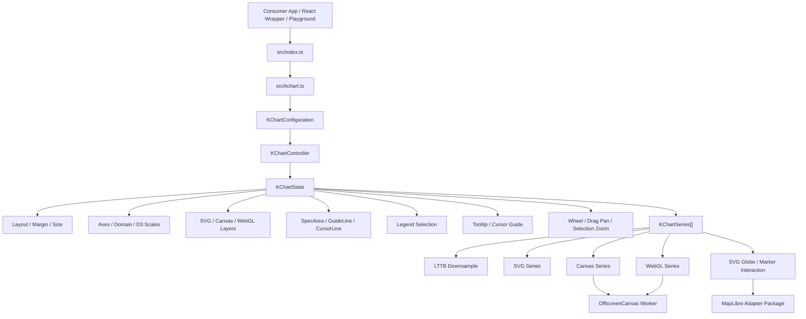
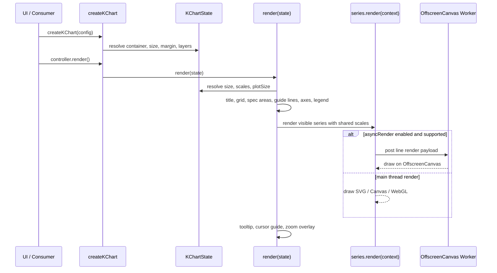

# KChart Code Graph Handoff

이 문서는 다음 작업 세션에서 KChart의 현재 구조와 진행 상태를 빠르게 복원하기 위한 handoff 문서입니다.

## Current Snapshot

- Package: `@keneth80/k-chart`
- Current public API style: class-free functional runtime
- Current release baseline: `1.6.0` published on 2026-06-18
- Current integration branch at handoff: `develop`
- Release tag: `v1.6.0`
- Published packages:
  - `@keneth80/k-chart@1.6.0`
- MapLibre publication status:
  - `npm publish --access public` accepted `@keneth80/k-chart-maplibre@0.1.0`.
  - Registry lookup still returned `E404` immediately afterward; verify package visibility before depending on the public package.
- Main source entry: `src/index.ts` -> `src/kchart.ts`
- Worker entry: `src/kchart-render.worker.ts`
- Public playground source link: intentionally removed because the playground repository may become private.
- Local playground target: `http://127.0.0.1:9011`
- Library demo target: `http://127.0.0.1:9003`

## High-Level Code Graph



## Runtime Render Pipeline



## Public API Surface

Primary exports come from `src/kchart.ts` through `src/index.ts`.

### Chart Runtime

- `createKChart<T>(config)`
- `KChartConfiguration<T>`
- `KChartController<T>`
- `KChartState<T>`
- `KChartAxis<T>`
- `KChartSeries<T>`

### Series Factories

- `createLineSeries<T>(...)`: SVG line and optional dots.
- `createCanvasLineSeries<T>(...)`: Canvas 2D line renderer.
- `createCanvasPointSeries<T>(...)`: Canvas 2D point renderer.
- `createCanvasCandlestickSeries<T>(...)`: Canvas 2D OHLC candlestick renderer with open/close or previous-close color modes.
- `createSvgGlobeSeries<T>(...)`: SVG orthographic globe renderer with draggable rotation, latitude/longitude markers, and marker click callbacks.
- `createWebglLineSeries<T>(...)`: WebGL line renderer for large data.
- `createWebglPointSeries<T>(...)`: WebGL point renderer using interleaved point buffer.
- `createCustomSeries<T>(...)`: user-defined renderer with access to chart layers and scales.

### Option Factories

- `createSpecAreaOption(...)`
- `createGuideLineOption(...)`
- `createCursorLineOption(...)`

Options can be passed through the unified `config.options` array. Legacy direct fields such as `specAreas`, `guideLines`, and `cursorGuide` are still read by the renderer.

### Performance APIs

- `downsampleLTTB<T>(data, threshold, xAccessor, yAccessor)`
- `startKChartRenderWorker(scope?)`
- Series-level `downsample`
- Series-level `asyncRender`

## Responsibility Map

| Area | Main Location | Responsibility |
| --- | --- | --- |
| Public exports | `src/index.ts` | Re-export public KChart API. |
| Types and config contracts | `src/kchart.ts` top section | Define axes, series, tooltip, zoom, option, and controller contracts. |
| Container and layers | `createLayers`, `ensureCanvas` | Create/reuse SVG root, plot groups, overlay, Canvas, and WebGL canvas layers. |
| Layout | `resolveSize`, `resolveEffectiveMargin` | Calculate size and dynamic top margin for title, legend, and option labels. |
| Scales and axes | `resolveAxisDomain`, `resolveScales`, `renderAxes` | Build D3 scales and render axes/titles. |
| Options | `renderSpecAreas`, `renderGuideLines`, `getCursorGuide` | Render fixed background regions, fixed guide lines, and cursor line config. |
| Legend | `renderLegend` | Render selectable series legend and update visibility. |
| Tooltip and cursor guide | `renderTooltip` | Hit-test series, show tooltip, draw cursor line and value labels. |
| Zoom | `renderZoom`, `resolveZoomedAxes`, `resolveSelectionZoomAxes` | Wheel zoom, mobile gesture zoom, drag pan, selection zoom, double-click reset. |
| Downsampling | `downsampleLTTB`, `resolveSeriesRenderData` | Reduce line data before rendering while preserving shape. |
| SVG series | `createLineSeries` | Render SVG line/dot visuals. |
| Canvas series | `createCanvasLineSeries`, `createCanvasPointSeries` | Render Canvas 2D line/point visuals. |
| WebGL series | `createWebglLineSeries`, `createWebglPointSeries` | Render WebGL line/point visuals. |
| Worker rendering | `startKChartRenderWorker`, `src/kchart-render.worker.ts` | OffscreenCanvas worker bootstrap and async line drawing. |
| Globe rendering | `createSvgGlobeSeries` | Orthographic globe, drag rotation, zoom controls, marker interaction, warp transition, and drilldown lifecycle. |
| Flat map adapter | `packages/k-chart-maplibre` | Optional MapLibre tile-map overlay, place markers, address popups, and return-to-globe bridge. |

## Data And Interaction Flow

```txt
KChartConfiguration<T>
  -> createKChart()
  -> KChartState<T>
  -> render()
     -> resolve scales from data + active axes
     -> render chart chrome
     -> filter visible series by legend state
     -> apply downsample when configured
     -> pass KChartRenderContext<T> to each series
     -> attach tooltip, cursor guide, and zoom overlay
```

Important state fields:

- `data`: current chart data.
- `axes`: active axes. Zoom updates this.
- `baseAxes`: original axes. Zoom reset returns to this.
- `series`: current series list.
- `visibleSeries`: legend-controlled visibility map.
- `zoomTransform`: current D3 zoom transform.
- `zoomSelection`: drag-selection state.

## Current Feature Status

### Done

- Class-free functional chart runtime.
- SVG, Canvas, WebGL series factories.
- Custom renderer API.
- Dark/light styling support through config and CSS.
- Legend selection and multi-series visibility.
- Tooltip support, including custom series tooltip hooks.
- Unified option array for spec areas, fixed guide lines, and cursor line.
- Dynamic title/legend/option-label top margin handling.
- LTTB downsampling for line series.
- OffscreenCanvas worker support for Canvas/WebGL line series.
- WebGL point interleaved buffer optimization.
- Wheel zoom, mobile gesture zoom, drag pan, drag-selection zoom, and double-click reset.
- `zoom.wheelZoom` and `zoom.gestureZoom` split desktop wheel/trackpad input from mobile touch gesture input without removing the older `mode` contract.
- Candlestick color modes support both `open-close` and `previous-close`; `previousCloseField` can point to an explicit previous close value.
- Globe map series uses `d3-geo` and expects ordinary `lat`/`lon` fields. It renders a built-in World Atlas 110m land layer plus country border mesh by default, accepts external GeoJSON through `landGeoJson`, supports country feature styling through `landMode: 'countries'`, `landFill`, `landStroke`, and `landOpacity`, and can enable wheel/pinch scaling plus in-chart zoom buttons through the `zoom` option.
- Globe drilldown supports `zoom`, internal `map`, and external `external-map` modes.
- Automatic external-map drilldown stores the globe center when dragging stops and warps from that settled coordinate without recentering the globe.
- Direct marker activation remains a city-focused transition. It fires on pointer release only when movement stays within 5px, preventing marker drags from being treated as clicks.
- `packages/k-chart-maplibre` provides `createMapLibreFlatMap` and `createMapLibreGlobeBridge`. A reused map is positioned at the next destination before its overlay is revealed, preventing the previous city from flashing.

### External Packages Around This Library

- `@keneth80/k-chart-react`: separate React wrapper package.
- `@keneth80/k-chart-maplibre`: optional flat-map adapter package stored in this repository under `packages/k-chart-maplibre`.
- KChart Next playground: separate app used for examples, editable configuration, and AI Builder. Its GitHub source link should not be exposed from public library docs while it is private or planned private.

## Known Design Decisions

- Axis, scale, layout, and interaction state belong to the core runtime.
- Visual drawing belongs to series renderers.
- Series receive already resolved scale information and can draw using SVG, Canvas, or WebGL.
- Custom visualizations should use `createCustomSeries` instead of class inheritance.
- OHLC-style charts should use axis `domainFields` so a single y-axis can derive its domain from multiple value fields such as `low` and `high`.
- The library does not execute user-edited JavaScript. Playground-generated configs should be validated before applying.
- Web Worker rendering is opt-in with `asyncRender` because bundler worker setup differs by application.
- Globe automatic zoom and marker clicks intentionally use separate camera behavior: automatic zoom preserves the settled viewport center, while marker activation may fly to the selected city.

## Latest Globe Interaction Flow

```txt
drag globe
  -> pointerup
  -> save projection center as [lon, lat]

automatic zoom threshold
  -> choose nearest registered city only for associated place data
  -> keep saved center as the drilldown coordinate
  -> play centered warp without rotating the globe
  -> reveal MapLibre at the saved center

marker press
  -> track pointer movement
  -> release within 5px: fly to marker, warp, reveal city map
  -> release after movement: cancel activation
```

## Release 1.6.0 Scope

- Globe zoom focus and internal Mercator drilldown examples.
- Automatic zoom-threshold transition and safe return zoom.
- Optional MapLibre flat-map adapter with real map tiles and place markers.
- Smoothed warp/reveal transition.
- Settled-center preservation for automatic drilldown.
- Reliable low-zoom marker activation on stationary pointer release.

## Verification Commands

Use these before release or handoff:

```bash
npm run typecheck
npm run build:lib
npm pack --dry-run
```

For local demo verification:

```bash
npm run dev
```

Then open `http://127.0.0.1:9003/`.

## Next Good Work Items

- Split `src/kchart.ts` into smaller modules once API behavior is stable:
  - `core/types.ts`
  - `core/layout.ts`
  - `core/scales.ts`
  - `core/interactions.ts`
  - `series/svg.ts`
  - `series/canvas.ts`
  - `series/webgl.ts`
  - `options/*.ts`
- Add unit tests for:
  - `downsampleLTTB`
  - `resolveEffectiveMargin`
  - zoom domain calculation
  - option array normalization
- Add browser-level regression checks for:
  - legend hit visibility
  - stacked/column tooltip behavior
  - topology hover behavior in the playground/wrapper layer
- Keep release notes in `CHANGELOG.md` aligned with npm versions.
